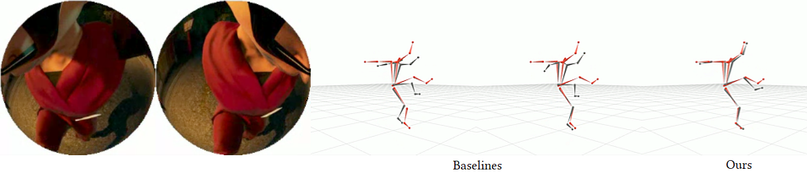

# Ego3DPose: Capturing 3D Cues from Binocular Egocentric Views (SIGGRAPH Asia 2023)


This repository contains codes for training and testing the method in the [paper](https://arxiv.org/abs/2309.11962).

## Citation
```
@inproceedings{kang2023ego3dpose,
    	author = {Kang, Taeho and Lee, Kyungjin and Zhang, Jinrui and Lee, Youngki},
        title = {Ego3DPose: Capturing 3D Cues from Binocular Egocentric Views},
    	year = {2023},
        isbn = {9798400703157},
        publisher = {Association for Computing Machinery},
        address = {New York, NY, USA},
        url = {https://doi.org/10.1145/3610548.3618147},
        doi = {10.1145/3610548.3618147},
    	booktitle = {SIGGRAPH Asia 2023 Conference Papers},
        keywords = {Egocentric, 3D Human Pose Estimation, Stereo vision, Heatmap},
        location = {Sydney, Australia},
        series = {SA '23}
}
```

The citation will be updated once it is uploaded to ACM library.

## Reprocessing
After downloading UnrealEgo dataset following instructions in [UnrealEgo](https://github.com/hiroyasuakada/UnrealEgo) repository, reprocess the dataset for our code.
reprocess_unrealego_data.py script parse metadata and process 2D and 3D pose data for Ego3DPose.

        python reprocess_unrealego_data.py

## Implementation

### Dependencies 
Our code is tested in the following environment

- Python 3.8.10
- Ubuntu 20.04
- PyTorch 2.0.1
- Cuda 12.0

You can install required packages with requirements.txt

### Training

You can train the models from scratch or use [trained weights](https://drive.google.com/drive/folders/1cjE-WPOqP62XjZkE7vJ7llVX3Fzsu2AR?usp=drive_link). The model weights will be saved in `./log/(experiment_name)`.

#### Heatmap

        bash scripts/train/ego3dpose_heatmap_shared/ego3dpose_heatmap_shared_pos.sh
        bash scripts/train/ego3dpose_heatmap_shared/ego3dpose_heatmap_shared_sin.sh

please specify the path to the UnrealEgo dataset in '--data_dir'.
        
#### AutoEncoder 

        bash scripts/train/ego3dpose_autoencoder/ego3dpose_autoencoder.sh

please specify the path to the UnrealEgo dataset in '--data_dir'.
After the training is finished, you will see quantitative results.

### Testing

If you want to see quantitative results using trained weights, run the command below.
This will also output result summary as a text file, which can be used for ploting for comparison of methods.

        bash scripts/test/ego3dpose_autoencoder.sh

### Comparison Method

We also provide our implementation of a previous work, EgoGlass with its body part branch.
We uploaded the weights in the [trained weights](https://drive.google.com/drive/folders/1cjE-WPOqP62XjZkE7vJ7llVX3Fzsu2AR?usp=drive_link).
You can test with pretrained weight with the following script.

        bash scripts/test/egoglass/egoglass.sh

You can also train the method with the following script.

        bash scripts/train/egoglass/egoglass.sh

UnrealEgo and EgoGlass without its body part branch can be experimented in the [UnrealEgo](https://github.com/hiroyasuakada/UnrealEgo) repository.

## License Terms
Permission is hereby granted, free of charge, to any person or company obtaining a copy of this software and associated documentation files (the "Software") from the copyright holders to use the Software for any non-commercial purpose. Publication, redistribution and (re)selling of the software, of modifications, extensions, and derivates of it, and of other software containing portions of the licensed Software, are not permitted. The Copyright holder is permitted to publically disclose and advertise the use of the software by any licensee.

Packaging or distributing parts or whole of the provided software (including code, models and data) as is or as part of other software is prohibited. Commercial use of parts or whole of the provided software (including code, models and data) is strictly prohibited. Using the provided software for promotion of a commercial entity or product, or in any other manner which directly or indirectly results in commercial gains is strictly prohibited.

THE SOFTWARE IS PROVIDED "AS IS", WITHOUT WARRANTY OF ANY KIND, EXPRESS OR IMPLIED, INCLUDING BUT NOT LIMITED TO THE WARRANTIES OF MERCHANTABILITY, FITNESS FOR A PARTICULAR PURPOSE AND NONINFRINGEMENT. IN NO EVENT SHALL THE AUTHORS OR COPYRIGHT HOLDERS BE LIABLE FOR ANY CLAIM, DAMAGES OR OTHER LIABILITY, WHETHER IN AN ACTION OF CONTRACT, TORT OR OTHERWISE, ARISING FROM, OUT OF OR IN CONNECTION WITH THE SOFTWARE OR THE USE OR OTHER DEALINGS IN THE SOFTWARE.

## Acknowledgments
This code is based on [UnrealEgo](https://github.com/hiroyasuakada/UnrealEgo) repository, and thus inherited its license terms.
We thank the authors of the UnrealEgo for the permission to share our codes.
